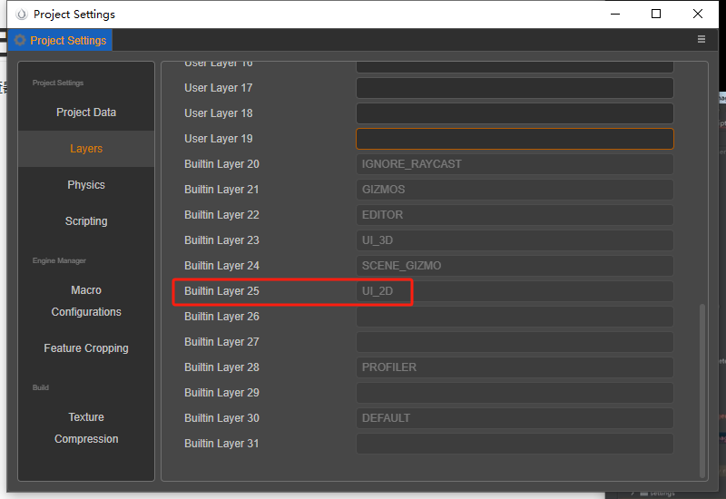
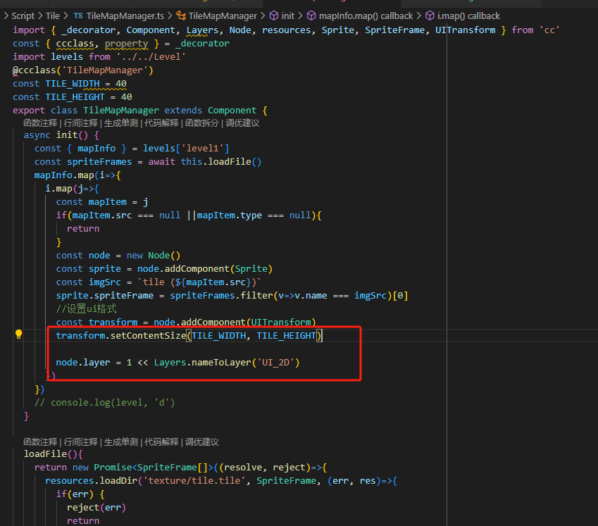
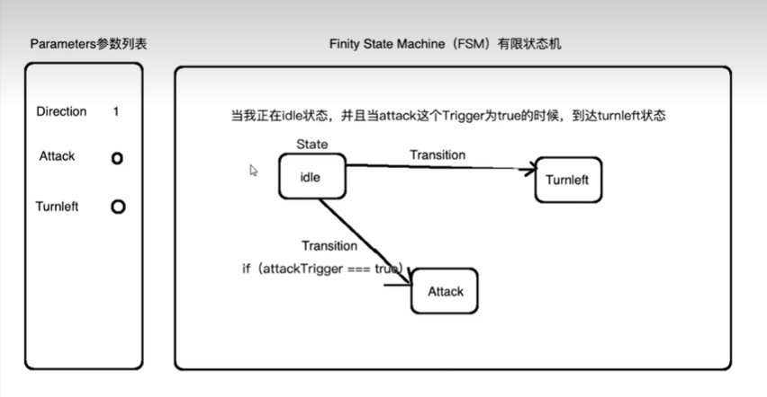

# COCOS引擎学习笔记

1.打开项目设置，可以查看属性值在cocos检查器中的对应的键名

也可以使用layer属性下的nameToLayer方法获取

### FSM状态机

是一个数据中心的处理方式，类似redux的方式，将全局数据放置在状态机中进行管理，将人物当前的动作状态，方向，身体状态等放入fsm中，通过执行setparams触发run方法进行数据的更新，重置当前状态，将状态更新，执行当前状态的setter方法，从而加载新状态的资源等，

#### 子状态机

子状态机中没有多余的其他方法，只有定义state的方法以及setter方法。执行子状态的run方法触发它的状态更新，从而实现资源加载